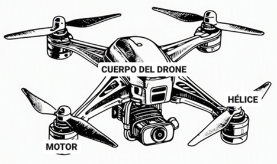
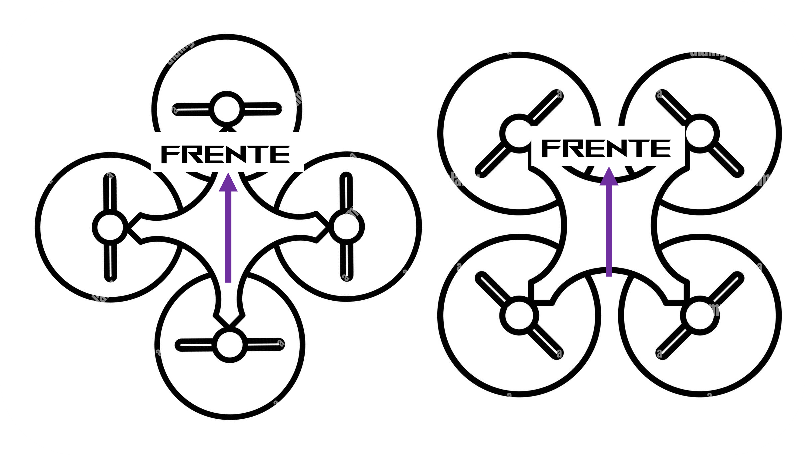
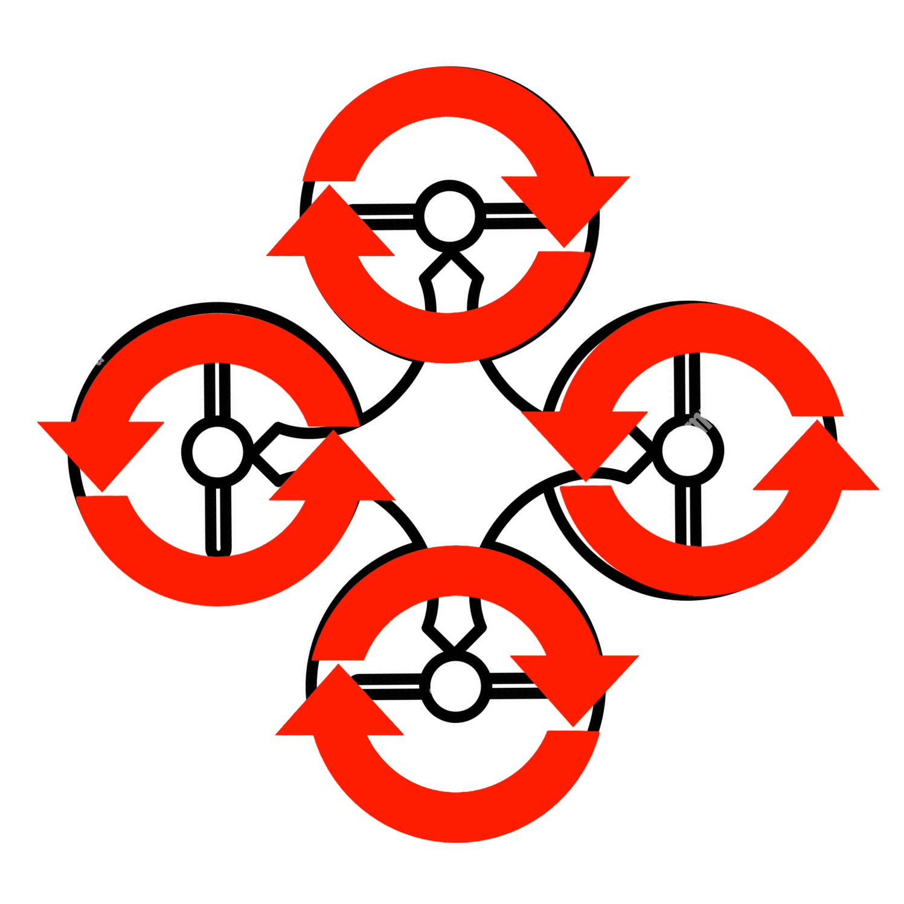
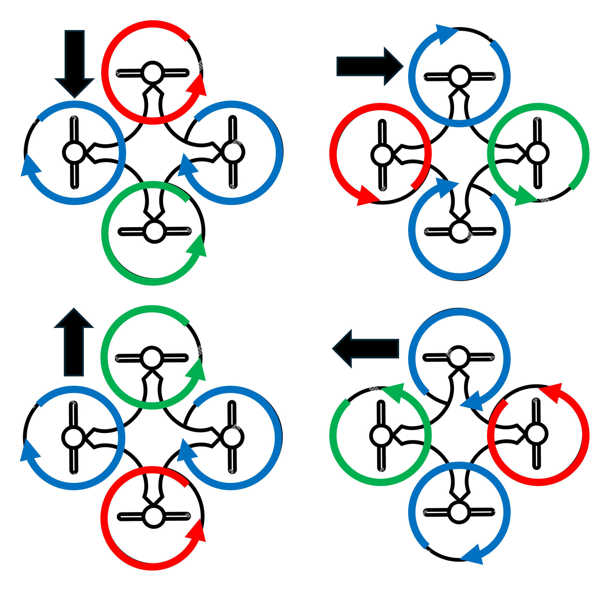

# Cinemática de un Cuadricóptero

Los cuadricópteros o drones están compuestos por un cuarpo principal, motores sin escobillas y propelas o hélices.

  

## Configuraciones
Existen dos configuraciones principales para el manejo de un dron:
* De forma "+"
* De forma "X"

Se debe de definir esta orientación para saber cual es el frente ya que en cada caso el control de los motores es diferente.

  

De estas configuraciones se trabajará con la forma en "+" ya que la matemática es más digerible y no es complicado ir de esa configuración a la configuración en "X".

## Principio de funcionamiento

Para que el cuadricóptero vuele es necesario que dos de sus motores giren en el sentido de las manesillas del reloj (CW) y los otros dos en contra de las manesillas del reloj (CCW) intercaladamente, como se observa en la imagen.

  

Con esto se logra un equilibrio de momentos lo cual es necesario para la estabilidad de vuelo del dron.

## Movimientos del Cuadricóptero
* **Movimiento en el eje Z**: Para que el dron se eleve, baje o se mantenga volando es necesario que las velocidades de giro de los motores sean iguales. El dron se moverá en el eje Z dependiendo de la velocidad de giro de la _Posición de Hover_ (o posición estacionaria), cuando las velocidades sean mayores a este humbral el dron se elevará y cuando sean menores el dron bajará.

* **Movimientos en los ejes X y Y**: Para mover el dron hacia adelante, atrás, izquierda o derecha, la velocidad de los motores debe ajustarse de forma coordinada. Los motores laterales, que son perpendiculares a la dirección a la que se quiere ir, mantienen su velocidad normal (flecha azul), igual que cuando el dron está suspendido en el aire (hover). Por otro lado, el motor trasero, que se encuentra opuesto a la dirección del movimiento, debe girar más rápido (flecha roja) para levantar esa parte del dron; mientras que el motor delantero, que apunta hacia donde se quiere ir, gira más lento (flecha verde) para bajar esa parte. Al subir la parte trasera y bajar la delantera, el dron se inclina, y esta inclinación aerodinámica es exactamente lo que lo empuja hacia la dirección deseada.

  

